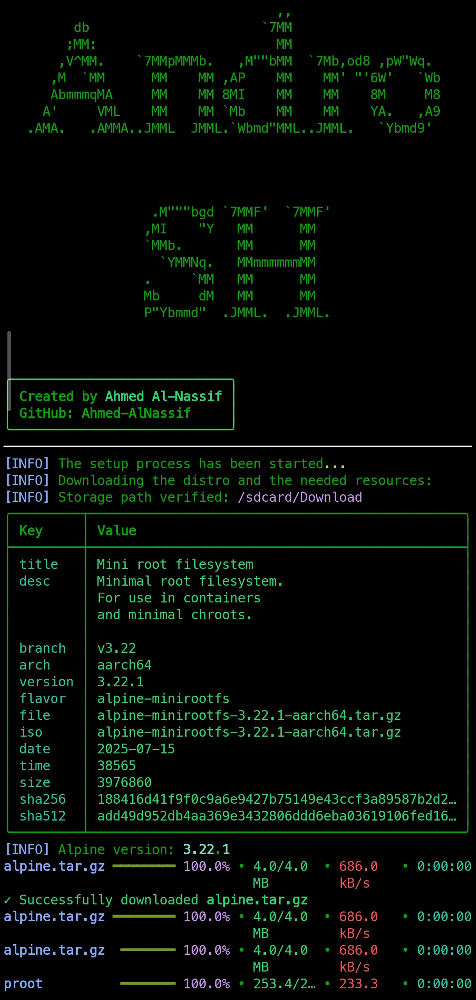
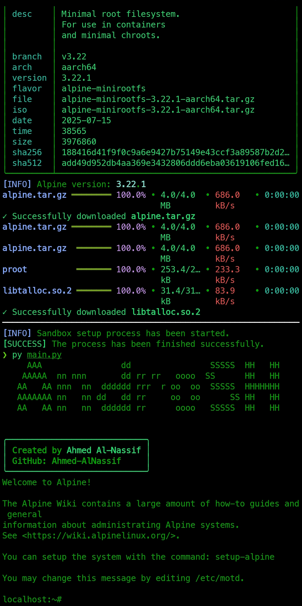

## Table of Contents

* [Overview](#overview)
* [Screenshots](#screenshots)
* [Features](#features)
* [Why AndroSH](#why-androsh)
* [Requirements](#requirements)
* [Installation](#installation)
* [Quick Start](#quick-start)
* [Usage Examples](#usage-examples)
* [Troubleshooting](#troubleshooting)
* [Security & Privacy](#security--privacy)
* [Contributing](#contributing)
* [License](#license)

---

## Overview

AndroSH is a lightweight Python project that helps you deploy an Alpine Linux userland on Android using `proot` and Shizuku. It is ideal for developers, security researchers, and power users who want an isolated, minimal Linux environment on their Android device without requiring full root.

This project leverages a small helper (Rish/Shizuku helper) to run commands with the elevated app permission provided by the Shizuku service. The bundled scripts and downloader automate fetching the Alpine tarball, extracting it, and launching the environment.

---

## Screenshots

<div align="center">





</div>

---

## Features

* Automated Alpine Linux download and extraction.
* `proot` wrapper script for launching Alpine in userland.
* Integration with Shizuku to run commands with elevated app permissions (without root).
* Simple Python CLI for setup, launch, and management.
* Includes helper assets (DEX shim) for Shizuku integration and example screenshots.

---

## Why AndroSH?

* **No root required:** Works with Shizuku to provide elevated permissions without unlocking the bootloader.
* **Lightweight:** Uses Alpine Linux to keep the environment small and fast.
* **Portable:** Runs from most Android terminals (Termux / UserLAnd / other shells) and standard Linux distributions.
* **Developer friendly:** Great for testing, development, and scripting on-device.

---

## Requirements

* Android device (API level compatible with Shizuku)
* Python 3.8+ (`python` / `python3`)
* `pip` or a Python package manager
* Shizuku (official app) installed and enabled on the device
* ADB (optional, for starting Shizuku via computer)

**Python dependencies** (see `requirements.txt`):

```
requests
rish
pyfiglet
PyYAML
```

Install with:

```bash
pip install -r requirements.txt
```

> Note: On Android you can use Termux or a similar terminal environment. Some distributions and Android terminals may require small adjustments to paths and executable permissions.

---

## Installation

1. Clone this repository or download the project archive.

```bash
git clone https://github.com/ahmed-alnassif/AndroSH.git
cd AndroSH
```

2. Install Python dependencies:

```bash
pip install -r requirements.txt
```

3. Install and enable Shizuku on your Android device. Follow the official Shizuku documentation to start the service either via ADB or by granting the app its elevated permission.

> Shizuku can be started using wireless debugging or ADB from your computer (official Shizuku docs explain the exact command for your platform). Starting Shizuku via ADB is typically required only once per boot.

---

## Quick Start

1. Ensure Shizuku is running and your device is ready.
2. From the project directory, run the main launcher:

```bash
python main.py
```

3. When inside the Alpine environment, you can use `apk` to install packages, run development tasks, or mount storage as needed via the provided wrapper.

---

## Usage Examples

* Launch AndroSH and open an interactive shell:

```bash
python main.py
```

---

## Troubleshooting

* **Shizuku not connected / permission denied:**

  * Make sure Shizuku app is installed and running.
  * If using ADB, start Shizuku via ADB as described in the Shizuku documentation.
  * Rebooting the device sometimes resolves permission inconsistencies.

* **Network or downloader failures:**

  * Check your device's network connectivity.

---

## Security & Privacy

* AndroSH uses Shizuku to execute commands with elevated app permissions. Only install Shizuku from a trusted source (official GitHub or Play Store). Review any DEX or helper binaries included in `Assets/` before running.

---

## Contributing

Contributions (issues, PRs, translations, testing on devices) are welcome. Please follow these steps:

1. Fork the repository.
2. Create a feature branch: `git checkout -b feature/your-feature`.
3. Commit changes and push.
4. Open a Pull Request describing your changes.

Please include device model, Android version, and steps to reproduce for bug reports.

---

## License

This project is provided under the MIT License. See `LICENSE` for full terms. If you prefer a different license, update the file accordingly.
